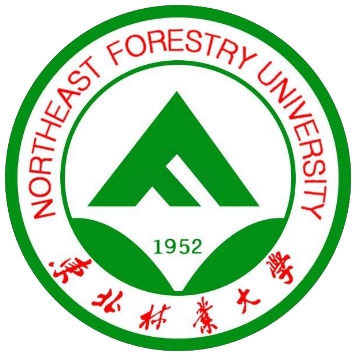








Hello, I’m Ning Jiang (江宁). I am currently a master's student majoring in Control Science and Engineering at [Northeast Forestry University](https://www.nefu.edu.cn/), advised by Prof. [Yining Xie (NEFU, 谢怡宁)](https://ccec.nefu.edu.cn/info/1237/4302.htm).  

My research interests include multimodal medical imaging, continual learning and person re-identification. I am still in the initial learning stage of my scientific research and have strong self-motivation. 

If you are seeking any form of **academic cooperation**, please feel free to email me at `jiangning@nefu.edu.cn`

Currently, my total number of citations on Google Scholar is over 100. <a href='https://scholar.google.com/citations?user=XfKD8e8AAAAJ'>

# 🔥 News
- **now**: &nbsp;🎓🎓 I have **2** papers that have been submitted and are **under review**.
- **2024.06**: &nbsp;📣📣 I received my B.E. degree from [Anhui Polytechnic University (AHPU)](https://www.ahpu.edu.cn/), awarded the Outstanding Graduate!
- **2022.10**: &nbsp;🎉🎉 Our new paper has been accepted by **Agriculture**!

# 📝 Publications 
*: Co-First Author (Equal Contribution)

 [An Attention Mechanism-Improved YOLOv7 Object Detection Algorithm for Hemp Duck Count Estimation](https://www.mdpi.com/2077-0472/12/10/1659) Kailin Jiang\*, Tianyu Xie, Rui Yan, Xi Wen, Danyang Li\*, Hongbo Jiang, **Ning Jiang**, Ling Feng, Xuliang Duan, Jianjun Wang | ESI Highly Cited Paper, Editor’s Choice Articles!

# 📝 Preprints
*: Co-First Author (Equal Contribution)

Preprint

[When Large Multimodal Models Confront Evolving Knowledge: Challenges and Pathways](https://arxiv.org/abs/2505.24449)

Kailin Jiang\*, Yuntao Du\*, Yukai Ding, Yuchen Ren, **Ning Jiang**, Zhi Gao, Zilong Zheng, Lei Liu, Bin Li, Qing Li.【2025.6】 
      

# 📰 Peer Review
- Computers and Electronics in Agriculture Reviewer
  
# 🎖 Honors and Awards
- **2024.09** Outstanding Undergraduate Thesis Award by the Anhui Provincial Automation Society.
- **2024.05** Outstanding Graduate of Regular Higher Education Institutions in Anhui Province.
- **2023.09** Top 100 University Students of Anhui Province.
- **2023.04** China International“Internet Plus” College Students’ Innovation and Entrepreneurship Competition - **National Bronze Award**.
- **2022.05** American College Mathematical Contest in Modeling - **Meritorious Winner**.

# 📖 Educations
- **2025.09 - 2028.06**, Master of Control Science and Engineering, Northeast Forestry University, Harbin, China. Supervised by Prof. [Yining Xie](https://ccec.nefu.edu.cn/info/1237/4302.htm).
- **2020.09 - 2024.06**, Bachelor of Automation, Anhui Polytechnic University, Wuhu, China. Supervised by Prof. [Yaocong Hu](https://cee.ahpu.edu.cn/_s31/2023/0918/c2103a200999/page.psp), Prof. [Wei Zhang](https://www.ahpu.edu.cn/slxy/2018/0331/c2715a100596/page.htm), and Prof. [Ke Xu](https://loop.frontiersin.org/people/1333327/overview).

<html lang="en">
<head>
    <meta charset="UTF-8">
    <meta name="viewport" content="width=device-width, initial-scale=1.0">
    <title>Map Widget</title>
    
</head>
<body>
    

    

</body>
</html>
